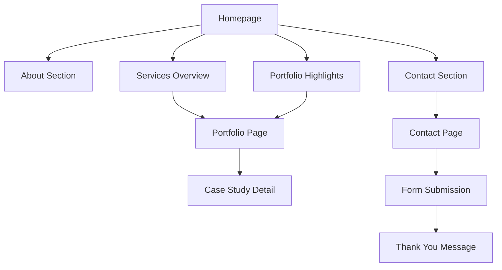

# Product Requirements Document - Narvex Landing Page

## 1. Product Overview
Narvex adalah perusahaan yang bergerak di bidang creative services dan event production dengan fokus pada branding, digital marketing, dan event management. Landing page ini akan menjadi representasi digital utama perusahaan untuk menarik klien potensial dan menampilkan portofolio layanan.

Tujuan utama landing page adalah untuk memperkenalkan Narvex sebagai partner terpercaya dalam creative solutions dan event production, serta mengkonversi visitor menjadi leads yang berkualitas.

## 2. Core Features

### 2.1 User Roles
Karena ini adalah landing page statis, tidak ada pembedaan role user yang kompleks:

| Role | Akses | Tujuan |
|------|-------|--------|
| Visitor | Akses penuh ke semua konten | Mencari informasi tentang layanan Narvex |
| Potential Client | Akses ke contact form | Menghubungi Narvex untuk inquiry |

### 2.2 Feature Module
Landing page Narvex terdiri dari halaman-halaman berikut:
1. **Home page**: hero section, navigation, about preview, services overview, portfolio highlights, testimonials, contact section
2. **Contact page**: contact form, company information, location map
3. **Portfolio page**: showcase projects, case studies, client testimonials

### 2.3 Page Details

| Page Name | Module Name | Feature Description |
|-----------|-------------|--------------------|
| Home page | Hero Section | Display compelling headline, company tagline, dan call-to-action button untuk inquiry |
| Home page | Navigation | Sticky navigation dengan logo Narvex, menu items (Home, About, Services, Portfolio, Contact) |
| Home page | About Preview | Brief introduction tentang Narvex, company values, dan unique selling proposition |
| Home page | Services Overview | Grid layout menampilkan main services: Creative Design, Event Production, Digital Marketing |
| Home page | Portfolio Highlights | Showcase 6-8 best projects dengan thumbnail dan brief description |
| Home page | Testimonials | Client testimonials dengan foto, nama, dan company |
| Home page | Contact Section | Contact information, social media links, dan quick contact form |
| Contact page | Contact Form | Form dengan fields: name, email, phone, service interest, message |
| Contact page | Company Info | Address, phone, email, business hours, social media links |
| Contact page | Location Map | Embedded Google Maps menunjukkan lokasi kantor |
| Portfolio page | Project Showcase | Grid layout dengan filter by category (Branding, Events, Digital) |
| Portfolio page | Case Studies | Detailed project descriptions dengan before/after, process, results |
| Portfolio page | Client List | Logo grid dari clients yang pernah bekerja sama |

## 3. Core Process

### User Journey Flow:
1. **Landing**: User mengakses homepage melalui search engine atau referral
2. **Discovery**: User melihat hero section dan services overview
3. **Exploration**: User scroll untuk melihat portfolio highlights dan testimonials
4. **Engagement**: User tertarik dan mengklik CTA untuk contact atau portfolio
5. **Conversion**: User mengisi contact form atau menghubungi via WhatsApp/email

## 4. User Interface Design

### 4.1 Design Style
- **Primary Colors**: 
  - Navy Blue (#1a365d) - untuk header, buttons, dan accents
  - White (#ffffff) - background utama
  - Light Gray (#f7fafc) - section backgrounds
- **Secondary Colors**:
  - Orange/Gold (#ed8936) - untuk highlights dan CTAs
  - Dark Gray (#2d3748) - untuk text content
- **Typography**: 
  - Heading: Inter atau Poppins (bold, modern)
  - Body: Open Sans atau System UI (readable, clean)
  - Font sizes: H1 (48px), H2 (36px), H3 (24px), Body (16px)
- **Button Style**: Rounded corners (8px), solid colors dengan hover effects
- **Layout Style**: Clean, modern, card-based design dengan generous white space
- **Icons**: Outline style icons (Heroicons atau Feather icons)

### 4.2 Page Design Overview

| Page Name | Module Name | UI Elements |
|-----------|-------------|-------------|
| Home page | Hero Section | Full-width background image/video, centered text overlay, gradient overlay, prominent CTA button |
| Home page | Navigation | Transparent/white background, logo kiri, menu items kanan, mobile hamburger menu |
| Home page | Services | 3-column grid pada desktop, 1-column mobile, icon + title + description, hover effects |
| Home page | Portfolio | Masonry atau grid layout, image thumbnails dengan overlay text, filter buttons |
| Home page | Testimonials | Carousel/slider dengan client photo, quote, name, company |
| Contact page | Contact Form | 2-column layout, form kiri, contact info kanan, validation states |
| Portfolio page | Project Grid | Filterable grid, category tags, hover effects dengan project details |

### 4.3 Responsiveness
Design menggunakan mobile-first approach dengan breakpoints:
- Mobile: 320px - 768px (single column layout)
- Tablet: 768px - 1024px (2-column layout)
- Desktop: 1024px+ (3-column layout)

Optimasi untuk touch interaction pada mobile devices dengan minimum touch target 44px dan spacing yang adequate untuk finger navigation.