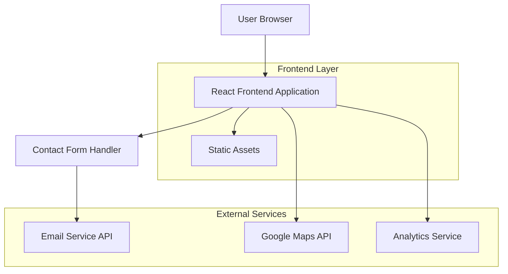

# Technical Architecture Document - Narvex Landing Page

## 1. Architecture Design



## 2. Technology Description

- **Frontend**: React@18 + TypeScript + Tailwind CSS@3 + Vite
- **Deployment**: Vercel atau Netlify (static hosting)
- **Form Handling**: Formspree atau EmailJS (untuk contact form)
- **Analytics**: Google Analytics 4
- **Maps**: Google Maps Embed API

## 3. Route Definitions

| Route | Purpose |
|-------|----------|
| / | Homepage dengan hero, services, portfolio highlights |
| /portfolio | Portfolio page dengan project showcase dan case studies |
| /contact | Contact page dengan form dan company information |
| /portfolio/[slug] | Individual project detail pages (future enhancement) |

## 4. Component Structure

### 4.1 Core Components

```typescript
// Layout Components
interface LayoutProps {
  children: React.ReactNode;
}

interface HeaderProps {
  isScrolled: boolean;
}

interface FooterProps {
  variant?: 'default' | 'minimal';
}

// Homepage Components
interface HeroSectionProps {
  title: string;
  subtitle: string;
  ctaText: string;
  backgroundImage: string;
}

interface ServiceCardProps {
  icon: string;
  title: string;
  description: string;
  features: string[];
}

interface PortfolioItemProps {
  id: string;
  title: string;
  category: string;
  image: string;
  description: string;
  tags: string[];
}

interface TestimonialProps {
  name: string;
  company: string;
  avatar: string;
  quote: string;
  rating: number;
}

// Contact Components
interface ContactFormProps {
  onSubmit: (data: ContactFormData) => void;
  isLoading: boolean;
}

interface ContactFormData {
  name: string;
  email: string;
  phone: string;
  service: string;
  message: string;
}
```

### 4.2 Data Types

```typescript
// Service Types
interface Service {
  id: string;
  name: string;
  description: string;
  icon: string;
  features: string[];
  image: string;
}

// Portfolio Types
interface Project {
  id: string;
  title: string;
  slug: string;
  category: 'branding' | 'events' | 'digital';
  description: string;
  longDescription: string;
  images: string[];
  tags: string[];
  client: string;
  year: number;
  featured: boolean;
}

// Testimonial Types
interface Testimonial {
  id: string;
  name: string;
  company: string;
  position: string;
  avatar: string;
  quote: string;
  rating: number;
  project?: string;
}

// Contact Types
interface ContactInfo {
  address: string;
  phone: string;
  email: string;
  socialMedia: {
    instagram: string;
    linkedin?: string;
    facebook?: string;
  };
  businessHours: {
    weekdays: string;
    weekend: string;
  };
}
```

## 5. Folder Structure

```
src/
├── components/
│   ├── layout/
│   │   ├── Header.tsx
│   │   ├── Footer.tsx
│   │   └── Layout.tsx
│   ├── home/
│   │   ├── HeroSection.tsx
│   │   ├── AboutSection.tsx
│   │   ├── ServicesSection.tsx
│   │   ├── PortfolioSection.tsx
│   │   └── TestimonialsSection.tsx
│   ├── portfolio/
│   │   ├── ProjectGrid.tsx
│   │   ├── ProjectCard.tsx
│   │   ├── ProjectFilter.tsx
│   │   └── CaseStudy.tsx
│   ├── contact/
│   │   ├── ContactForm.tsx
│   │   ├── ContactInfo.tsx
│   │   └── LocationMap.tsx
│   └── ui/
│       ├── Button.tsx
│       ├── Card.tsx
│       ├── Modal.tsx
│       └── Loading.tsx
├── pages/
│   ├── HomePage.tsx
│   ├── PortfolioPage.tsx
│   └── ContactPage.tsx
├── data/
│   ├── services.ts
│   ├── projects.ts
│   ├── testimonials.ts
│   └── contact.ts
├── hooks/
│   ├── useContactForm.ts
│   ├── useScrollPosition.ts
│   └── usePortfolioFilter.ts
├── utils/
│   ├── constants.ts
│   ├── helpers.ts
│   └── validation.ts
└── styles/
    ├── globals.css
    └── components.css
```

## 6. Performance Optimization

### 6.1 Image Optimization
- Menggunakan Next.js Image component atau React image optimization library
- Lazy loading untuk images di portfolio section
- WebP format dengan fallback ke JPEG
- Responsive images dengan multiple breakpoints

### 6.2 Code Splitting
- Route-based code splitting untuk setiap page
- Dynamic imports untuk heavy components (maps, carousel)
- Bundle analysis untuk monitoring size

### 6.3 SEO Optimization
- Meta tags untuk setiap page
- Open Graph tags untuk social sharing
- Structured data (JSON-LD) untuk business information
- Sitemap.xml generation

## 7. Development Workflow

### 7.1 Development Setup
```bash
# Install dependencies
npm install

# Start development server
npm run dev

# Build for production
npm run build

# Preview production build
npm run preview
```

### 7.2 Deployment
- **Staging**: Automatic deployment dari branch `develop` ke Vercel preview
- **Production**: Manual deployment dari branch `main` ke Vercel production
- Environment variables untuk API keys (Google Maps, Analytics)

### 7.3 Content Management
Untuk fase static, content akan disimpan dalam file TypeScript/JSON di folder `data/`. Future enhancement bisa mengintegrasikan dengan headless CMS seperti Strapi atau Contentful.