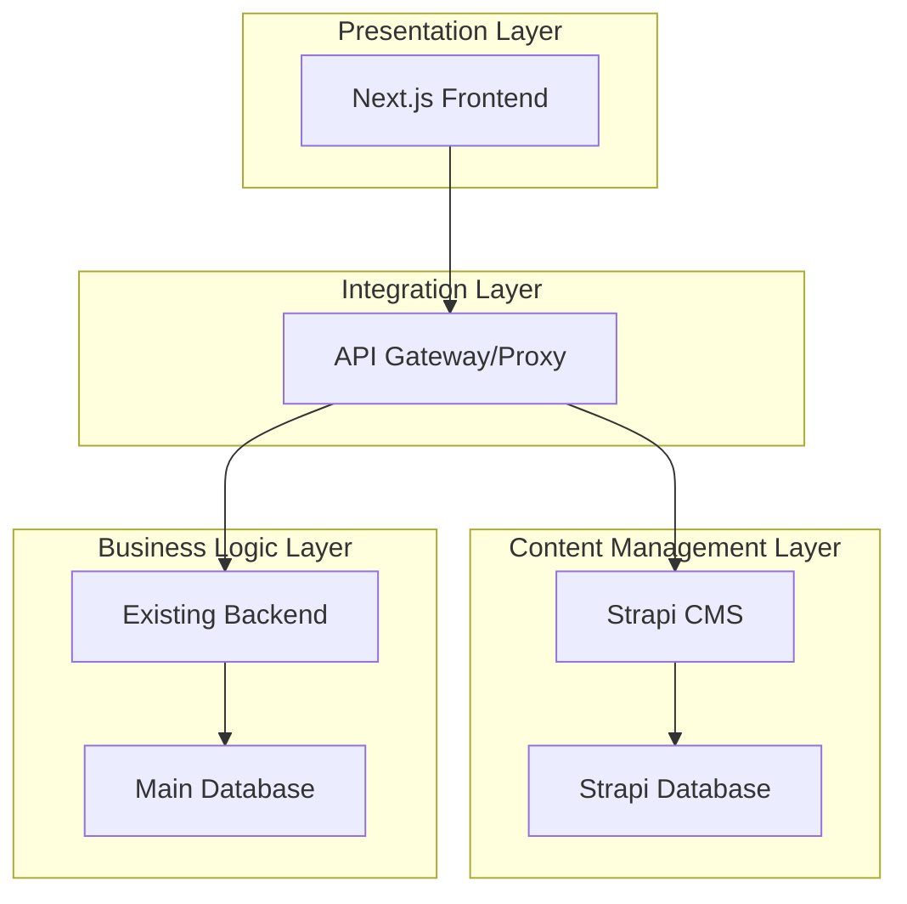
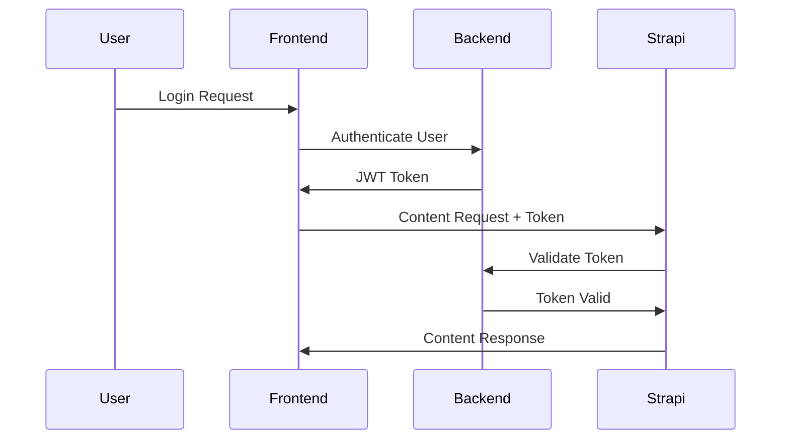
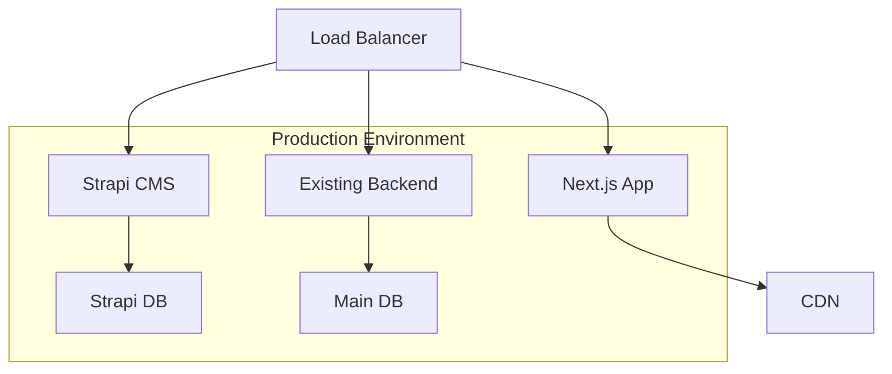

# Strapi + Existing Backend Hybrid Architecture

## 1. Architecture Overview

This document outlines a hybrid architecture approach that leverages Strapi CMS for content management while maintaining your friend's existing backend development for business logic and core functionality.

### 1.1 System Architecture Diagram



### 1.2 Hybrid Approach Benefits

- **Strapi**: Handles content management, media library, and admin interface
- **Existing Backend**: Manages business logic, user authentication, and complex operations
- **Clear Separation**: Content vs. business logic separation
- **Parallel Development**: Both systems can be developed simultaneously

## 2. Technology Stack

### 2.1 Frontend Layer
- **Framework**: Next.js 15 + React 19 + TypeScript
- **Styling**: Tailwind CSS
- **State Management**: TanStack Query for API state
- **Authentication**: NextAuth.js or custom JWT handling

### 2.2 Content Management Layer (Strapi)
- **CMS**: Strapi v4/v5
- **Database**: PostgreSQL (separate from main DB)
- **Authentication**: Strapi built-in admin auth
- **APIs**: REST + GraphQL

### 2.3 Business Logic Layer (Existing Backend)
- **Framework**: [To be determined by your friend]
- **Database**: [Existing database choice]
- **Authentication**: [Existing auth system]
- **APIs**: REST/GraphQL endpoints

### 2.4 Integration Layer
- **API Gateway**: Next.js API routes or dedicated proxy
- **Data Sync**: Webhooks + background jobs
- **Caching**: Redis (optional)

## 3. API Integration Strategy

### 3.1 API Routing Pattern

```typescript
// Next.js API routes acting as proxy/gateway

// Content-related requests → Strapi
GET  /api/content/companies     → Strapi
GET  /api/content/projects      → Strapi
GET  /api/content/blog          → Strapi
POST /api/content/media        → Strapi

// Business logic requests → Existing Backend
POST /api/auth/login           → Existing Backend
GET  /api/analytics/dashboard   → Existing Backend
POST /api/business/orders      → Existing Backend
GET  /api/users/profile        → Existing Backend
```

### 3.2 Frontend API Client Structure

```typescript
// lib/api/index.ts
export const api = {
  // Strapi content APIs
  content: {
    companies: () => fetch('/api/content/companies'),
    projects: () => fetch('/api/content/projects'),
    blog: () => fetch('/api/content/blog'),
  },
  
  // Business logic APIs
  business: {
    auth: (credentials) => fetch('/api/auth/login', { body: credentials }),
    analytics: () => fetch('/api/analytics/dashboard'),
    users: () => fetch('/api/users/profile'),
  }
};
```

### 3.3 Data Synchronization

**Strapi → Existing Backend**
- Webhooks for content updates
- Background sync jobs for critical data
- Event-driven architecture

**Existing Backend → Strapi**
- API calls for user-generated content
- Scheduled data imports
- Real-time updates via webhooks

## 4. Content Types and Data Models

### 4.1 Strapi Content Types

**Companies Collection**
```json
{
  "name": "Text",
  "tagline": "Text",
  "description": "Rich Text",
  "logo": "Media",
  "website": "Text",
  "email": "Email",
  "phone": "Text",
  "whatsapp": "Text",
  "social": "JSON",
  "services": "Text (Multiple)",
  "established": "Text",
  "location": "Text",
  "color": "Text",
  "isParent": "Boolean",
  "status": "Enumeration",
  "createdAt": "DateTime",
  "updatedAt": "DateTime"
}
```

**Projects Collection**
```json
{
  "title": "Text",
  "slug": "UID",
  "category": "Enumeration",
  "company": "Relation (Companies)",
  "client": "Text",
  "location": "Text",
  "date": "Date",
  "description": "Rich Text",
  "longDescription": "Rich Text",
  "services": "Text (Multiple)",
  "images": "Media (Multiple)",
  "tags": "Text (Multiple)",
  "results": "JSON",
  "featured": "Boolean",
  "status": "Enumeration",
  "seo": "Component (SEO)"
}
```

**Blog Posts Collection**
```json
{
  "title": "Text",
  "slug": "UID",
  "content": "Rich Text",
  "excerpt": "Text",
  "featuredImage": "Media",
  "author": "Relation (Authors)",
  "categories": "Relation (Categories)",
  "tags": "Text (Multiple)",
  "publishedAt": "DateTime",
  "status": "Enumeration",
  "seo": "Component (SEO)"
}
```

**Media Library**
- Automatic image optimization
- Multiple format support
- CDN integration
- Alt text and SEO metadata

### 4.2 Existing Backend Data Models

**User Management**
- User profiles and authentication
- Role-based permissions
- Activity logging
- Session management

**Business Analytics**
- Performance metrics
- User behavior tracking
- Conversion analytics
- Custom reporting

**Integration Data**
- Third-party API integrations
- Payment processing
- Email marketing
- CRM synchronization

## 5. Implementation Phases

### Phase 1: Foundation Setup (Week 1-2)

**Strapi Setup**
```bash
# Create Strapi project
npx create-strapi-app@latest narvex-cms --quickstart

# Install additional plugins
npm install @strapi/plugin-seo
npm install @strapi/plugin-i18n
npm install @strapi/plugin-upload
```

**Tasks:**
1. Install and configure Strapi
2. Set up PostgreSQL database for Strapi
3. Create basic content types (Companies, Projects, Blog)
4. Configure admin users and permissions
5. Set up media library and upload settings

**Coordination with Backend Team:**
- Define API contracts and data formats
- Establish webhook endpoints
- Plan authentication integration
- Set up development environments

### Phase 2: Content Migration (Week 3)

**Data Migration Strategy**
```javascript
// scripts/migrate-data.js
const migrateCompanies = async () => {
  const companies = require('../src/data/companies.ts');
  
  for (const company of companies) {
    await strapi.entityService.create('api::company.company', {
      data: {
        name: company.name,
        tagline: company.tagline,
        description: company.description,
        // ... other fields
      }
    });
  }
};
```

**Tasks:**
1. Create migration scripts for existing data
2. Import companies, projects, and blog data
3. Upload and organize media assets
4. Set up content relationships
5. Configure SEO metadata

### Phase 3: API Integration (Week 4-5)

**Next.js API Proxy Setup**
```typescript
// pages/api/content/[...slug].ts
export default async function handler(req, res) {
  const { slug } = req.query;
  const path = Array.isArray(slug) ? slug.join('/') : slug;
  
  // Proxy to Strapi
  const strapiResponse = await fetch(`${process.env.STRAPI_URL}/api/${path}`, {
    method: req.method,
    headers: {
      'Authorization': `Bearer ${process.env.STRAPI_TOKEN}`,
      'Content-Type': 'application/json',
    },
    body: req.method !== 'GET' ? JSON.stringify(req.body) : undefined,
  });
  
  const data = await strapiResponse.json();
  res.status(strapiResponse.status).json(data);
}
```

**Tasks:**
1. Set up API proxy in Next.js
2. Create TypeScript interfaces for Strapi data
3. Implement TanStack Query hooks
4. Set up error handling and caching
5. Test API integration

### Phase 4: Admin Interface Integration (Week 6)

**Custom Strapi Plugins**
```javascript
// plugins/narvex-integration/admin/src/index.js
export default {
  register(app) {
    // Custom admin panel modifications
    app.addMenuLink({
      to: '/plugins/narvex-integration',
      icon: 'cog',
      intlLabel: {
        id: 'narvex-integration.plugin.name',
        defaultMessage: 'Narvex Integration',
      },
    });
  },
};
```

**Tasks:**
1. Customize Strapi admin interface
2. Add company-specific branding
3. Create custom content workflows
4. Set up user roles and permissions
5. Configure content approval processes

### Phase 5: Advanced Features (Week 7-8)

**Webhook Integration**
```typescript
// Strapi webhook handler
module.exports = {
  async afterCreate(event) {
    const { result } = event;
    
    // Notify existing backend of content changes
    await fetch(`${process.env.BACKEND_URL}/webhooks/strapi`, {
      method: 'POST',
      headers: { 'Content-Type': 'application/json' },
      body: JSON.stringify({
        event: 'content.created',
        model: event.model,
        data: result,
      }),
    });
  },
};
```

**Tasks:**
1. Implement real-time content synchronization
2. Set up automated backups
3. Configure CDN for media delivery
4. Add analytics and monitoring
5. Performance optimization

## 6. Security Considerations

### 6.1 Authentication Flow



### 6.2 Security Measures

**Strapi Security**
- Admin panel access restrictions
- API token management
- Content permissions by role
- Rate limiting on APIs
- CORS configuration

**Integration Security**
- Webhook signature verification
- API key rotation
- Encrypted data transmission
- Input validation and sanitization
- Audit logging

**Frontend Security**
- JWT token handling
- XSS protection
- CSRF prevention
- Secure cookie settings
- Content Security Policy

## 7. Development Workflow

### 7.1 Team Coordination

**Daily Standups**
- Strapi development progress
- Backend API updates
- Integration challenges
- Deployment coordination

**Weekly Planning**
- Feature prioritization
- API contract reviews
- Testing coordination
- Performance monitoring

### 7.2 Environment Setup

**Development**
```bash
# Strapi development
cd narvex-cms
npm run develop

# Next.js development
cd fe-narvex
npm run dev

# Backend development
cd narvex-backend
[backend-specific commands]
```

**Environment Variables**
```env
# Strapi
STRAPI_URL=http://localhost:1337
STRAPI_TOKEN=your-api-token

# Backend
BACKEND_URL=http://localhost:3000
BACKEND_API_KEY=your-backend-key

# Database
DATABASE_URL=postgresql://...
STRAPI_DATABASE_URL=postgresql://...
```

## 8. Deployment Strategy

### 8.1 Production Architecture



### 8.2 Deployment Steps

1. **Strapi Deployment**
   - Deploy to cloud provider (AWS, DigitalOcean, etc.)
   - Configure production database
   - Set up CDN for media files
   - Configure SSL certificates

2. **Backend Coordination**
   - Ensure API compatibility
   - Update webhook endpoints
   - Configure production secrets
   - Test integration endpoints

3. **Frontend Deployment**
   - Update API endpoints
   - Configure environment variables
   - Deploy to Vercel/Netlify
   - Test end-to-end functionality

## 9. Monitoring and Maintenance

### 9.1 Performance Monitoring

- **Strapi Metrics**: Response times, database queries, memory usage
- **Integration Health**: Webhook success rates, API latency
- **Content Delivery**: CDN performance, image optimization
- **User Experience**: Page load times, error rates

### 9.2 Backup Strategy

- **Strapi Database**: Daily automated backups
- **Media Files**: Cloud storage with versioning
- **Configuration**: Version-controlled settings
- **Integration Data**: Cross-system backup verification

## 10. Future Considerations

### 10.1 Scalability

- **Horizontal Scaling**: Multiple Strapi instances
- **Database Optimization**: Read replicas, indexing
- **Caching Strategy**: Redis, CDN optimization
- **Microservices**: Further service separation

### 10.2 Feature Expansion

- **Multi-language Support**: Strapi i18n plugin
- **Advanced Workflows**: Content approval processes
- **Analytics Integration**: Custom dashboard widgets
- **Mobile App Support**: Strapi mobile SDKs

This hybrid architecture allows you to leverage Strapi's powerful content management capabilities while maintaining your friend's backend development work, ensuring both teams can work efficiently toward the same goal.